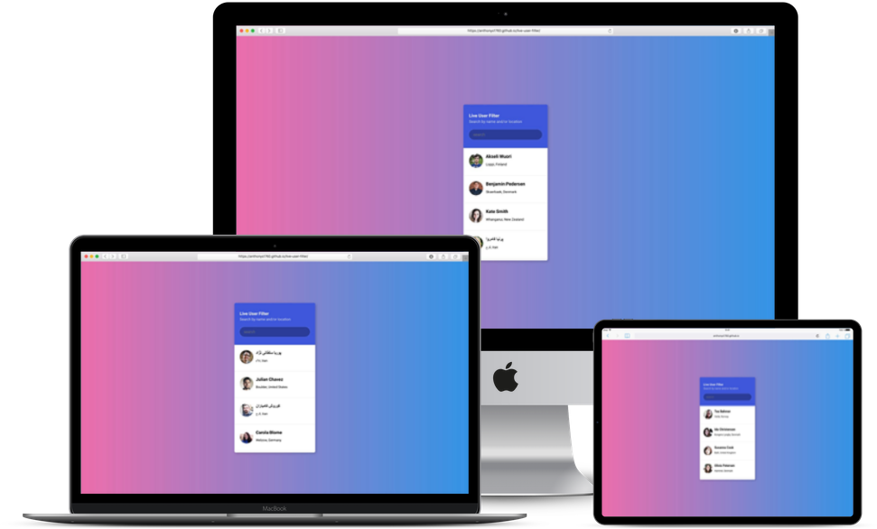

# Live Search Filter

Web App with Live API Call filtering capabilities.  Search filter utilizes the randomuser.me API to List random user's and locations data as you type into the input box providing an instant searchable experience.

## Project Sections

- Live API Call Search Capability
- Search by name and/or by location
- Updates as you type
- Useful in large or small databases where users and data need to be found quickly and effectively
 
## Steps to execute this App:
- Download the entire code 
- Open up the index.html.
- [View Live Site](https://anthonys1760.github.io/live-user-filter/)

## Technologies used: 
- HTML
- CSS
- Javascript
- Randomuser.me API

